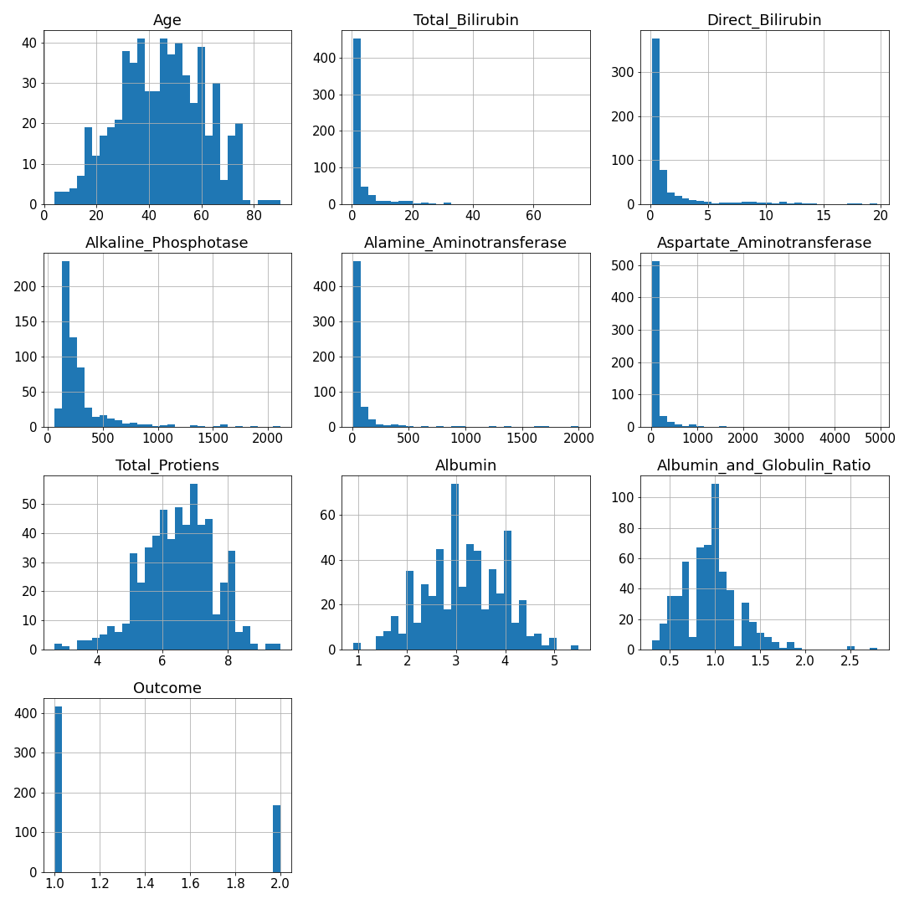
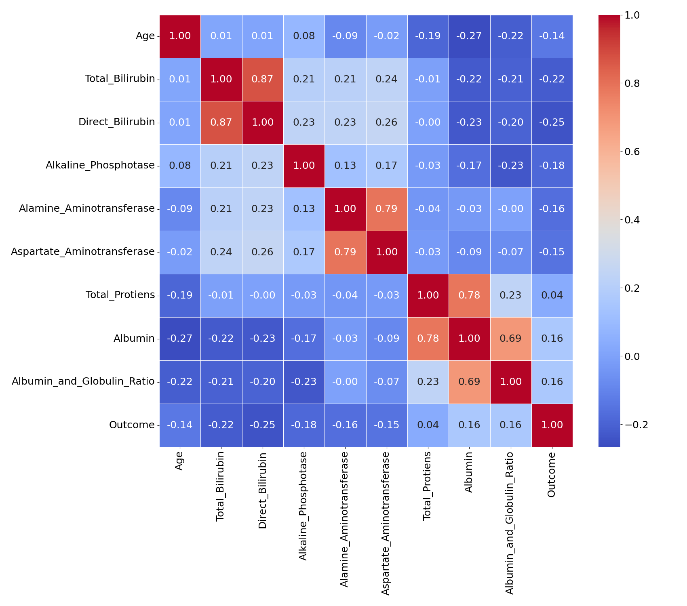
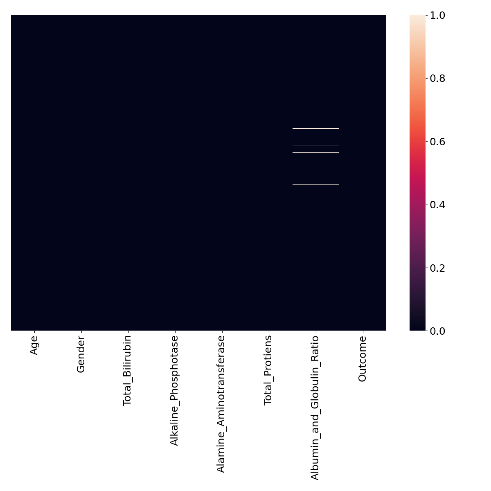
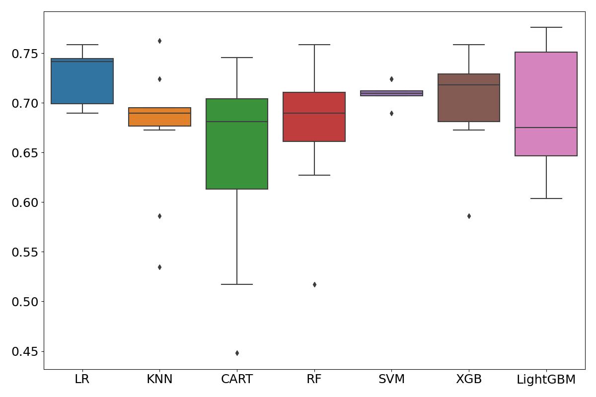
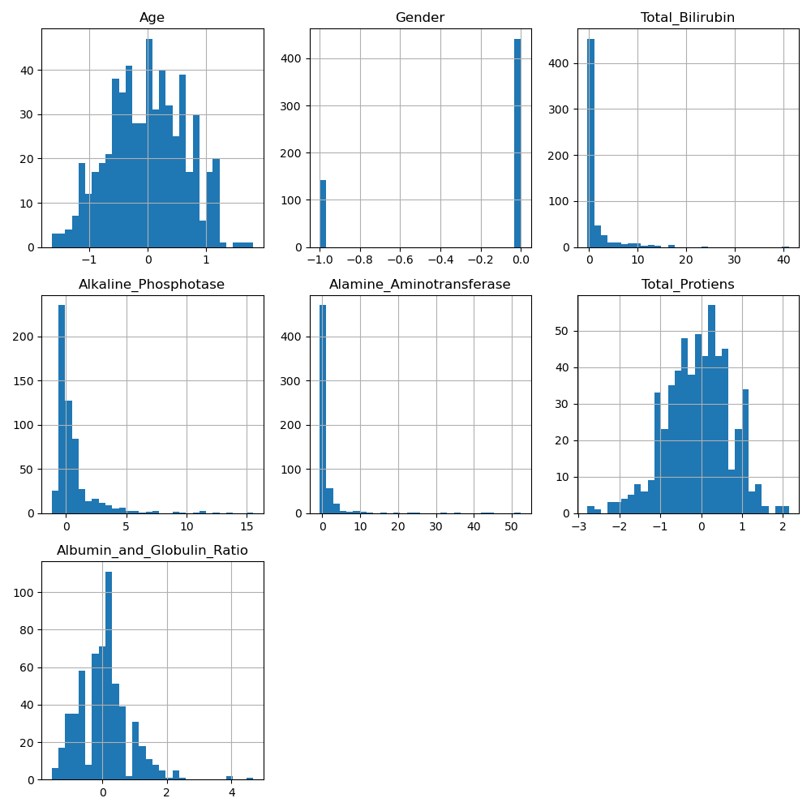
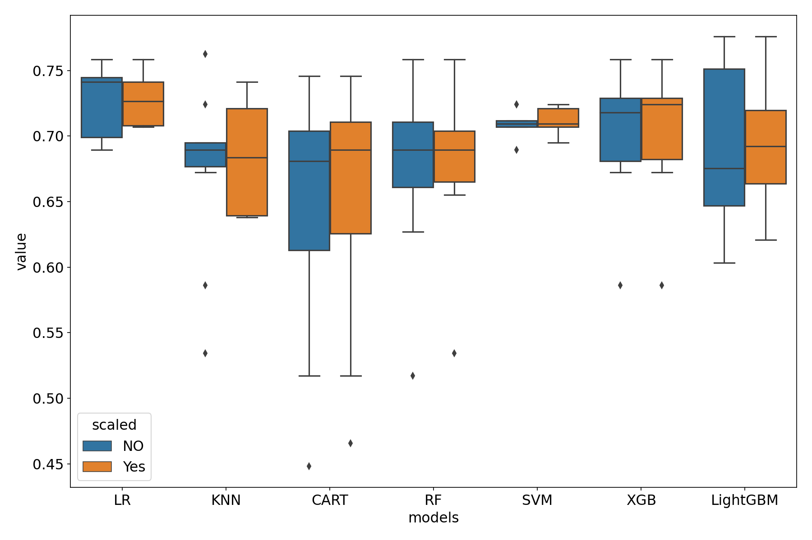
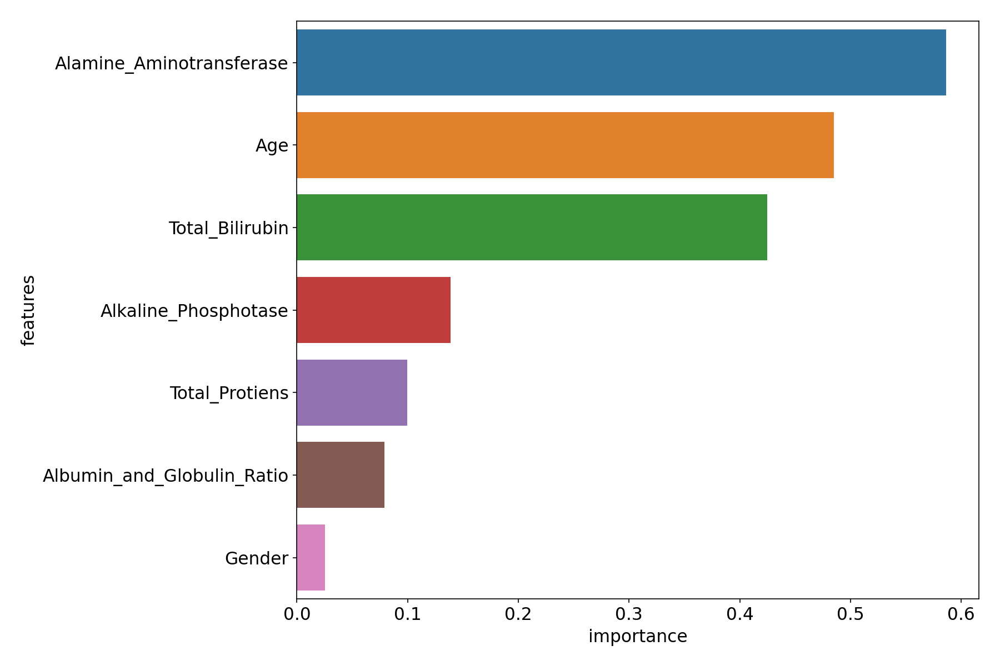

Table of contents
- [Liver Disease Prediction](#liver-disease-prediction)
- [Explorative Data Analysis](#explorative-data-analysis)
  - [Feature correlations](#feature-correlations)
  - [Fill the missing values](#fill-the-missing-values)
- [Classification Models](#classification-models)
- [Performance of models after scaling dataset](#performance-of-models-after-scaling-dataset)
- [Feature importance](#feature-importance)
- [Conclusion](#conclusion)
- [Acknowledgements](#acknowledgements)
# Liver Disease Prediction
dataset source:[UCI ML Repository](<'https://archive.ics.uci.edu/ml/datasets/ILPD+(Indian+Liver+Patient+Dataset)>)

**Information**

Data Set Information:  dsafaf

This data set contains 416 liver patient records and 167 non liver patient records.The data set was collected from north east of Andhra Pradesh, India. Selector is a class label used to divide into groups(liver patient or not). This data set contains 441 male patient records and 142 female patient records.

Any patient whose age exceeded 89 is listed as being of age "90".

Attribute Information:

1. Age Age of the patient
2. Gender Gender of the patient
3. TB Total Bilirubin
4. DB Direct Bilirubin
5. Alkphos Alkaline Phosphotase
6. Sgpt Alamine Aminotransferase
7. Sgot Aspartate Aminotransferase
8. TP Total Protiens
9. ALB Albumin
10. A/G Ratio Albumin and Globulin Ratio
11. Selector field used to split the data into two sets (labeled by the experts)

attribute 11:
1. patient
2. not patient

# Explorative Data Analysis
583 rows with 11 features are in the data. Last feature **'Dataset'** is the outcome. Except 'Albumin_and_Globulin_Ratio' there is no missing values in any of the features.

The mean values fluctuates quite a lot, highest and lowest values are  
'Alkaline_Phosphotase'  = 290.576329 and  
Albumin_and_Globulin_Ratio  =    0.947064.

The data needs be normalized.

Renamed the feature name 'Dataset' to 'Outcome'.
The outcome featuer has values 1 and 2 for patient and not patient respectively.

The distribution of features is shown below:

From the range of values it is quite clear that data needs normalization.

## Feature correlations
The correlation plot among the features is shown below:

1. correlation between Total_Bilirubin and Direct_Bilirubin is high: 0.9. One of them can be removed.
2. correlation between Alamine_Aminotransferase and Aspartate_Aminotransferase is high: 0.8.
3. correlation between Total_Protiens and Albumin is high: 0.8.

features to be dropped = Direct_Bilirubin,Aspartate_Aminotransferase,Albumin

## Fill the missing values

This is the heatmap of the missing values.

I planned to fill the missing values by mean values.

Let's check the mean values with respect to gender.

Female = 	0.949000  
Male   = 0.946446

The mean values with respect to 'Outcome'.

1: 0.9141787439613527,  
2: 1.0295757575757576

Mean values based on Gender are almost same. However, meanvalues by outcome is slight different. Hence the missing values will be filled based on Outcome.

Finally replace the Gender values as 0 and 1 for 'Female' and 'Male'.

# Classification Models
First I am using all the data without scaling.
Here I compared seven classification models.

- Logistic Regression
- KNN
- Dicision Tree Classification
- RandomForest Classifier
- SVM
- Gradient Boosting Classifier
- Light GBM

The following plot shows the accuracy of the above models:

From the above figure we can conclude LogisticRegression is 
giving the best accuracy score.  

Let's check the performance of the models for scaled data.

# Performance of models after scaling dataset

The range of all the featuers after
 scaling using RobustScaler.

Here is the performance of models before and after scaling the dataset.

- It is clear that LogisticRegression gives the best accuracy score.

# Feature importance

Though LogisticRegression has no attribute as feature_importance, 
here I am using absolute values of coefficients as feature importance(for scaled dataset). 

# Conclusion
- Scaling data has limited influence to the model performance for this dataset.
- After testing 7 machine learning model I observed LogisticRegression is providing best accuracy score.

- Will do model optimization later.

# Acknowledgements

1. Dua, D. and Graff, C. (2019). UCI Machine Learning Repository [http://archive.ics.uci.edu/ml]. Irvine, CA: University of California, School of Information and Computer Science.

2. Bendi Venkata Ramana, Prof. M. S. Prasad Babu and Prof. N. B. Venkateswarlu, “A Critical Comparative Study of Liver Patients from USA and INDIA: An Exploratory Analysis”, International Journal of Computer Science Issues, ISSN :1694-0784, May 2012.

3. Bendi Venkata Ramana, Prof. M. S. Prasad Babu and Prof. N. B. Venkateswarlu, “A Critical Study of Selected Classification Algorithms for Liver Disease Diagnosis”, International Journal of Database Management Systems (IJDMS), Vol.3, No.2, ISSN : 0975-5705, PP 101-114, May 2011.